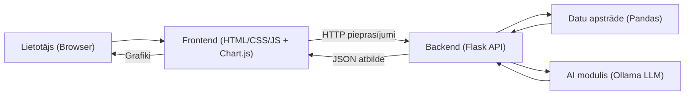

# 🧠 AI Data Visualization Tool

Projekts nodrošina datu augšupielādi, analīzi un vizualizāciju, izmantojot mākslīgā intelekta metodes.

<p align="center">
  
  
  
  
  
  
  
  
  
</p>

---
## 🔍 Projekta pārskats

### Ko dara:
Lietotājs var augšupielādēt strukturētus datu failus (CSV vai Excel), sistēma automātiski apstrādā datus, izvēlas piemērotākos grafikus un attēlo tos interaktīvā formā.
### Kā strādā:
Backend izmanto Python un Flask, datu analīzei – Pandas, mākslīgā intelekta funkcionalitātei – lokāls LLM modelis ar Ollama, frontendā tiek izmantots Chart.js vizualizācijai.
### Ko saņem lietotājs:
Interaktīvu datu vizualizāciju, automātiski ģenerētus grafikus un ātru datu analīzi bez nepieciešamības manuāli izvēlēties vizualizācijas veidu.

---
## 🖥 Kā lietot


---
## 🧩 Sistēmas arhitektūra



*Attēls: Projekta augsta līmeņa arhitektūra – lietotāja pieprasījumi, datu apstrāde un AI lēmumu pieņemšana.

---
## ⚙️ Tehnoloģiju steks

| Komponents             | Tehnoloģija             |
| ---------------------- | ----------------------- |
| **Backend**            | Python 3.10+, Flask     |
| **Datu apstrāde**      | Pandas, NumPy           |
| **AI modulis**         | Ollama, LLM             |
| **Frontend**           | HTML5, CSS3, JavaScript |
| **Datu vizualizācija** | Chart.js                |

---
## 🚀 Uzstādīšana

### 1. Klonē repozitoriju:
```bash
git clone https://github.com/SairnaD/AI-based-data-visualization.git
cd <project-folder>
```

### 2. Palaid uzstādīšanas skriptu:
```bash
bash setup.sh
```

### Uzstādīšana automātiski:
- izveido virtuālo vidi (venv)
- uzinstalē Python bibliotēkas
- uzinstalē Ollama (ja nepieciešams)
- lejupielādē AI modeli

---
## ▶️ Sistēmas palaišana

### 1. Aktivizē virtuālo vidi:
```bash
source venv/bin/activate
```

### 2. Palaid serveri:
```bash
python app.py
```
### 3. Atver pārlūkā:
```bash
http://localhost:5000
```

---
## 📝 API apraksts

- **POST /upload** – pieņem datu failu un atgriež ieteikumus par vizualizāciju
- **GET /data** – atgriež apstrādātus datus grafiku attēlošanai

---
## 🧠 Mākslīgā intelekta izmantošana

Sistēma izmanto lokālu lielo valodas modeli (LLM) ar Ollama, lai:
- analizētu datu kolonnu tipus
- interpretētu datu tipus
- izvēlētos optimālos vizualizācijas veidus

---
## ⚠️ Ierobežojumi

- Atbalsta tikai CSV un XLSX failus
- Lieliem datu apjomiem iespējama ilgāka apstrāde
- Nepieciešama lokāla Ollama darbība
